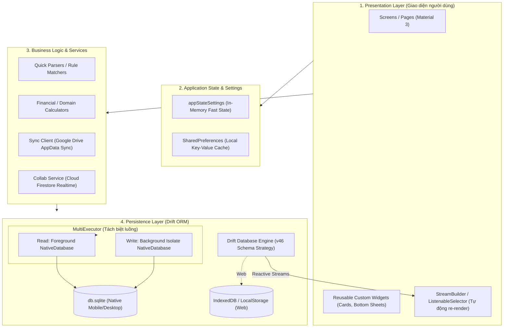

# 📱 CASHEW ARCHITECTURE & DESIGN SYSTEM BLUEPRINT
> **Tài liệu đặc tả kiến trúc, hệ thống giao diện và cẩm nang triển khai cho AI Agent & Developer**  
> *Được chuẩn hóa từ kiến trúc mã nguồn ứng dụng Cashew (Flutter, Drift SQLite Local-First, Google Drive Sync & Material 3 Design System).*

---

## 📌 HƯỚNG DẪN DÀNH CHO AI AGENT KHI NHẬN DỰ ÁN MỚI
Nếu bạn là một **AI Agent** được yêu cầu xây dựng ứng dụng mới dựa trên tệp này:
1. **Bắt buộc tuân thủ triết lý Local-First**: SQLite là nguồn chân lý duy nhất (Single Source of Truth). Không phụ thuộc máy chủ trung tâm để app hoạt động. Mọi tính năng cốt lõi phải chạy 100% ngoại tuyến (Offline-First).
2. **Bắt buộc tuân thủ Concurrency Pattern (MultiExecutor)**: Đọc chạy ở luồng chính (Foreground), ghi chạy ngầm ở Isolate (Background) để không giật lag UI (zero frame drops).
3. **Bắt buộc tuân thủ Reactive Query UI**: Tầng giao diện lắng nghe dữ liệu thông qua Drift Streams (`database.watch*()`) kết hợp `StreamBuilder`. Không dùng `setState()` thủ công sau mỗi truy vấn DB.
4. **Bắt buộc tuân thủ Design System Cashew**: Áp dụng triệt để hệ thống bảng màu (Semantic & Container colors qua `ThemeExtension`), typography, bo góc tròn 16-24px, bottom sheet dạng kéo trượt, và micro-animations.

---

# PHẦN 1: TRIẾT LÝ KIẾN TRÚC HỆ THỐNG (SYSTEM ARCHITECTURE)

## 1.1. Mô hình Phân tầng (Layered Architecture)



---

## 1.2. Các Nguyên tắc Cốt lõi của Kiến trúc Cashew

### 1. Offline-First & Privacy-by-Design
- Người dùng sở hữu hoàn toàn dữ liệu của họ.
- Ứng dụng không cần máy chủ riêng (Zero server maintenance cost).
- Không có bước đăng ký tài khoản bắt buộc; mở app là dùng được ngay lập tức.

### 2. MultiExecutor Concurrency Pattern
Trong Flutter, các tác vụ I/O nặng hoặc ghi nhiều bản ghi SQLite đồng thời có thể gây giật giao diện (frame drops). Cashew giải quyết triệt để vấn đề này bằng cách chia đôi Executor:
- **Foreground Executor**: Dành riêng cho các truy vấn `SELECT` đọc dữ liệu cực nhanh cho UI.
- **Background Isolate Executor**: Dành riêng cho các thao tác `INSERT`, `UPDATE`, `DELETE`, chạy trên luồng ngầm riêng của Dart Isolate.

### 3. Reactive Data Streaming (No-Refresh UI)
- Thay vì gọi hàm `loadData()` và `setState()` mỗi lần thêm/sửa/xóa, Drift tự động theo dõi bảng dữ liệu.
- Mọi hàm truy vấn trả về `Stream<List<T>>` (ví dụ: `watchAllTransactions()`). Khi có lệnh `INSERT`, Drift tự động phát event mới vào Stream và giao diện cập nhật ngay lập tức.

### 4. Đồng bộ Đám mây Cá nhân (Personal Cloud Sync)
- Sử dụng **Google Drive v3 API** với phạm vi bảo mật `drive.appDataFolder`.
- Lưu trữ các bản snapshot SQLite dưới dạng tệp `sync-[clientID].sqlite`.
- So sánh dấu thời gian `dateTimeModified` và bảng ghi xóa `DeleteLogs` (Tombstones) để hợp nhất (merge) dữ liệu giữa các thiết bị mà không cần máy chủ trung gian.

---

# PHẦN 2: HỆ THỐNG GIAO DIỆN (CASHEW DESIGN SYSTEM)

Cashew nổi tiếng nhờ giao diện đậm chất **Material You (Material 3)**, hỗ trợ đổi màu linh hoạt theo hình nền thiết bị, cảm giác cầm nắm cao cấp, bo góc mượt mà và trực quan sinh động.

## 2.1. Bảng màu Chuẩn (Color Tokens)

Hệ thống màu của Cashew sử dụng `ThemeExtension<AppColors>` để truy xuất thông qua hàm tiện ích `getColor(context, "tên_màu")`.

```dart
// Helper truy xuất màu chuẩn Cashew
Color getColor(BuildContext context, String colorName) {
  return Theme.of(context).extension<AppColors>()?.colors[colorName] ?? Colors.red;
}
```

### Bảng tra cứu Mã màu Chi tiết:

| Token Name | Light Mode (HEX) | Dark Mode (HEX) | Mô tả & Cách ứng dụng |
|---|---|---|---|
| `white` | `#FFFFFF` | `#000000` | Màu tương phản tuyệt đối cho background/surface. |
| `black` | `#000000` | `#FFFFFF` | Màu chữ và icon chính tương phản cao. |
| `textLight` | `rgba(0,0,0,0.4)` hoặc `#888888` | `rgba(255,255,255,0.4)` hoặc `#494949` | Màu chữ phụ, mô tả, nhãn ngày tháng, hint text. |
| `canvasContainer` | `#EBEBEB` | `#242424` | Nền phía sau màn hình chính (App Canvas Background). |
| `lightDarkAccent` | `#F7F7F7` (hoặc pastel) | `#161616` (hoặc dark pastel) | Nền của Card, Item trong danh sách, Sheet body. |
| `lightDarkAccentHeavyLight` | `#FFFFFF` / `#F3F3F3` | `#242424` | Nền container cấp 2, khung hiển thị biểu đồ. |
| `standardContainerColor` | Light pastel secondary | Dark pastel secondary | Nền các khối nổi bật (Featured widgets, Total balance). |
| `incomeAmount` | **`#59A849`** | **`#62CA77`** | Màu số tiền Thu nhập (Xanh lá mềm mại, tích cực). |
| `expenseAmount` | **`#CA5A5A`** | **`#DA7272`** | Màu số tiền Chi tiêu (Đỏ san hô dịu mắt, không gắt). |
| `warningOrange` | **`#CA995A`** | **`#DA9C72`** | Màu cảnh báo vượt hạn mức hoặc sắp quá hạn. |
| `unPaidUpcoming` | **`#58A4C2`** | **`#7DB6CC`** | Màu hóa đơn / giao dịch sắp đến hạn. |
| `unPaidOverdue` | **`#6577E0`** | **`#8395FF`** | Màu khoản nợ / hóa đơn đã quá hạn. |
| `starYellow` | `#FFD723` | `#FFD723` | Màu đánh dấu yêu thích / ghim (Pinned). |
| `dividerColor` | `rgba(0, 0, 0, 0.06)` | `rgba(255, 255, 255, 0.08)` | Đường kẻ phân cách cực mảnh, thanh lịch. |

### Thuật toán Làm mềm màu Pastel (Cashew Custom Algorithm):
```dart
Color lightenPastel(Color color, {double amount = 0.8}) {
  return Color.lerp(color, Colors.white, amount) ?? color;
}

Color darkenPastel(Color color, {double amount = 0.8}) {
  return Color.lerp(color, Colors.black, amount) ?? color;
}
```

---

## 2.2. Quy chuẩn Typography

- **Font chữ ưu tiên**: Inter, Google Sans, Roboto hoặc font hệ thống mặc định không chân (Sans-Serif).
- **Hệ thống thứ bậc (Hierarchy)**:
  - **Hero Amount Display**: `fontSize: 34-42`, `fontWeight: FontWeight.bold`, số tiền hiển thị to rõ nét ở đầu trang.
  - **Screen Title / Section Header**: `fontSize: 22-26`, `fontWeight: FontWeight.w800`, chữ hoa chữ thường tự nhiên.
  - **Card Title**: `fontSize: 16-17`, `fontWeight: FontWeight.w600`.
  - **Body / Subtitle**: `fontSize: 14`, `fontWeight: FontWeight.normal`, màu `textLight`.
  - **Meta / Caption**: `fontSize: 11-12`, `fontWeight: FontWeight.w500`, dùng cho ngày tháng, badge danh mục.

---

## 2.3. Quy chuẩn Hình khối, Bo góc & Đổ bóng (Component Stylings)

1. **Bo góc (Border Radius)**:
   - Thẻ danh mục / Thẻ thống kê (Cards): `BorderRadius.circular(20)` hoặc `24`.
   - Nút bấm (Buttons) & Quick Chips: `BorderRadius.circular(16)`.
   - Bottom Sheet: Bo tròn hai góc trên `BorderRadius.vertical(top: Radius.circular(28))`.
   - Không sử dụng góc nhọn (`BorderRadius.circular(0)`) để giữ phong cách thân thiện, hiện đại.

2. **Bề mặt phân lớp (Layered Surface Elevation)**:
   - Hạn chế tối đa bóng đổ đậm (Drop shadows nặng nề).
   - Phân biệt độ sâu giao diện bằng sự tương phản màu nền:
     - Nền ứng dụng: `canvasContainer` (`#EBEBEB` / `#242424`).
     - Bề mặt Card: `lightDarkAccent` (`#F7F7F7` / `#161616`).
     - Khối bên trong Card: `lightDarkAccentHeavyLight` hoặc màu Pastel nhẹ.

3. **Tương tác Kéo trượt (Sliding Bottom Sheets)**:
   - Các tác vụ thêm mới, lọc, chi tiết không mở trang mới hoàn toàn mà ưu tiên mở qua Bottom Sheet trượt mượt mà.
   - Luôn có thanh gạt nhận diện cử chỉ (Drag Handle): Rộng `40px`, cao `4px`, bo tròn, màu `dividerColor`.

---

# PHẦN 3: CẤU TRÚC THƯ MỤC CHUẨN CỦA DỰ ÁN

Khi áp dụng kiến trúc này vào ứng dụng mới, tổ chức thư mục theo cấu trúc phân tầng rõ ràng (Feature-First kết hợp Core Infrastructure):

```text
lib/
├── core/
│   ├── database/
│   │   ├── platform/
│   │   │   ├── native.dart        # Cấu hình MultiExecutor (Isolates + SQLite)
│   │   │   ├── web.dart           # Cấu hình IndexedDB cho Web
│   │   │   └── shared.dart        # Conditional exports
│   │   ├── tables/                # Định nghĩa các bảng Drift
│   │   │   ├── transactions_table.dart
│   │   │   ├── categories_table.dart
│   │   │   ├── budgets_table.dart
│   │   │   └── delete_logs_table.dart
│   │   ├── daos/                  # Data Access Objects chuyên trách
│   │   └── app_database.dart      # Entry point của Drift Database
│   │
│   ├── theme/
│   │   ├── app_colors.dart        # ThemeExtension & Color tokens
│   │   ├── app_theme.dart         # Cấu hình ThemeData (Light & Dark)
│   │   └── typography.dart        # Text styles chuẩn
│   │
│   ├── services/
│   │   ├── sync_client.dart       # Đồng bộ qua Google Drive AppData
│   │   ├── realtime_collab.dart   # Đồng bộ nhóm qua Cloud Firestore
│   │   └── notification_service.dart # Local notifications
│   │
│   └── utils/
│       ├── debouncer.dart         # Gom nhóm thao tác trước khi sync
│       └── formatters.dart        # Định dạng tiền tệ, ngày tháng
│
├── features/                      # Các tính năng theo Domain
│   ├── dashboard/
│   │   ├── presentation/
│   │   └── widgets/
│   ├── transactions/
│   │   ├── presentation/
│   │   └── widgets/
│   └── settings/
│
└── main.dart                      # Khởi tạo DB, Notification, Theme, RunApp
```

---

# PHẦN 4: MÃ NGUỒN MẪU ĐỂ TÁI SỬ DỤNG (CODE BOILERPLATES)

## 4.1. Thiết lập CSDL Drift với MultiExecutor (`core/database/platform/native.dart`)

```dart
import 'dart:io';
import 'dart:typed_data';
import 'package:drift/drift.dart';
import 'package:drift/native.dart';
import 'package:path_provider/path_provider.dart';
import 'package:path/path.dart' as p;
import '../app_database.dart';

Future<AppDatabase> constructDb(String dbName) async {
  final db = LazyDatabase(() async {
    final dbFolder = await getApplicationDocumentsDirectory();
    final file = File(p.join(dbFolder.path, '$dbName.sqlite'));

    // Đọc trên Foreground, Ghi trong Background Isolate riêng biệt
    QueryExecutor foregroundExecutor = NativeDatabase(file);
    QueryExecutor backgroundExecutor = NativeDatabase.createInBackground(file);

    return MultiExecutor(
      read: foregroundExecutor, 
      write: backgroundExecutor,
    );
  });
  return AppDatabase(db);
}
```

---

## 4.2. Cấu trúc Bảng CSDL Chuẩn & Tombstones (`core/database/tables/`)

```dart
import 'package:drift/drift.dart';
import 'package:uuid/uuid.dart';

const uuid = Uuid();

// 1. BẢNG TOMBSTONE PHỤC VỤ ĐỒNG BỘ HAI CHIỀU KHÔNG MẤT DỮ LIỆU
enum DeleteLogType { transaction, category, budget }

@DataClassName('DeleteLog')
class DeleteLogs extends Table {
  TextColumn get deleteLogPk => text().clientDefault(() => uuid.v4())();
  TextColumn get entryPk => text()();
  IntColumn get type => intEnum<DeleteLogType>()();
  DateTimeColumn get dateTimeModified => dateTime().withDefault(Constant(DateTime.now()))();

  @override
  Set<Column> get primaryKey => {deleteLogPk};
}

// 2. BẢNG GIAO DỊCH TIÊU CHUẨN
@DataClassName('Transaction')
class Transactions extends Table {
  TextColumn get transactionPk => text().clientDefault(() => uuid.v4())();
  TextColumn get name => text().withLength(max: 250)();
  RealColumn get amount => real()();
  TextColumn get note => text().withLength(max: 500).nullable()();
  TextColumn get categoryFk => text()();
  TextColumn get walletFk => text().withDefault(const Constant("0"))();
  DateTimeColumn get dateCreated => dateTime().clientDefault(() => DateTime.now())();
  DateTimeColumn get dateTimeModified => dateTime().withDefault(Constant(DateTime.now()))();
  BoolColumn get income => boolean().withDefault(const Constant(false))();
  
  // Trường phục vụ đồng bộ đám mây
  TextColumn get sharedKey => text().nullable()();

  @override
  Set<Column> get primaryKey => {transactionPk};
}
```

---

## 4.3. DAO Truy vấn Reactive Stream (`core/database/daos/transaction_dao.dart`)

```dart
import 'package:drift/drift.dart';
import '../app_database.dart';
import '../tables/transactions_table.dart';
import '../tables/delete_logs_table.dart';

part 'transaction_dao.g.dart';

@DriftAccessor(tables: [Transactions, DeleteLogs])
class TransactionDao extends DatabaseAccessor<AppDatabase> with _$TransactionDaoMixin {
  TransactionDao(AppDatabase db) : super(db);

  // 1. Reactive Watcher: UI tự lắng nghe không cần Refresh
  Stream<List<Transaction>> watchAllTransactions() {
    return (select(transactions)
          ..orderBy([(t) => OrderingTerm.desc(t.dateCreated)]))
        .watch();
  }

  // 2. Thao tác Ghi an toàn (cập nhật dateTimeModified)
  Future<void> insertOrUpdate(TransactionsCompanion entry) async {
    final now = DateTime.now();
    final updatedEntry = entry.copyWith(dateTimeModified: Value(now));
    await into(transactions).insertOnConflictUpdate(updatedEntry);
  }

  // 3. Xóa an toàn: Lưu lại Tombstone vào DeleteLogs để đồng bộ sang máy khác
  Future<void> deleteSafely(String pk) async {
    await transaction(() async {
      await (delete(transactions)..where((t) => t.transactionPk.equals(pk))).go();
      await into(deleteLogs).insert(
        DeleteLogsCompanion.insert(
          entryPk: pk,
          type: DeleteLogType.transaction,
          dateTimeModified: Value(DateTime.now()),
        ),
      );
    });
  }
}
```

---

## 4.4. Hệ thống ThemeExtension (`core/theme/app_colors.dart`)

```dart
import 'package:flutter/material.dart';

class AppColors extends ThemeExtension<AppColors> {
  final Map<String, Color> colors;

  AppColors({required this.colors});

  @override
  ThemeExtension<AppColors> copyWith({Map<String, Color>? colors}) {
    return AppColors(colors: colors ?? this.colors);
  }

  @override
  ThemeExtension<AppColors> lerp(ThemeExtension<AppColors>? other, double t) {
    if (other is! AppColors) return this;
    Map<String, Color> newColors = {};
    colors.forEach((key, value) {
      newColors[key] = Color.lerp(value, other.colors[key], t) ?? value;
    });
    return AppColors(colors: newColors);
  }
}

AppColors getCashewThemeColors(Brightness brightness, Color accentColor) {
  bool isLight = brightness == Brightness.light;
  return AppColors(
    colors: {
      "white": isLight ? Colors.white : Colors.black,
      "black": isLight ? Colors.black : Colors.white,
      "textLight": isLight ? const Color(0xFF888888) : const Color(0xFF8E8E93),
      "canvasContainer": isLight ? const Color(0xFFEBEBEB) : const Color(0xFF1E1E1E),
      "lightDarkAccent": isLight ? const Color(0xFFF7F7F7) : const Color(0xFF141414),
      "lightDarkAccentHeavyLight": isLight ? Colors.white : const Color(0xFF242424),
      "incomeAmount": isLight ? const Color(0xFF59A849) : const Color(0xFF62CA77),
      "expenseAmount": isLight ? const Color(0xFFCA5A5A) : const Color(0xFFDA7272),
      "warningOrange": const Color(0xFFCA995A),
      "dividerColor": isLight ? const Color(0x0F000000) : const Color(0x13FFFFFF),
    },
  );
}
```

---

## 4.5. Debouncer cho Tự động Đồng bộ (`core/utils/debouncer.dart`)

```dart
import 'dart:async';
import 'package:flutter/foundation.dart';

class Debouncer {
  final int milliseconds;
  Timer? _timer;

  Debouncer({required this.milliseconds});

  void run(VoidCallback action) {
    _timer?.cancel();
    _timer = Timer(Duration(milliseconds: milliseconds), action);
  }

  void dispose() {
    _timer?.cancel();
  }
}
```

---

# PHẦN 5: CHECKLIST VÀ PROMPT CHỈ ĐẠO AI AGENT (AI PROMPTS)

Khi bạn muốn AI xây dựng ứng dụng mới dựa trên tệp tài liệu này, hãy cung cấp các Prompt chuẩn dưới đây:

### 🎯 Prompt 1: Khởi tạo Kiến trúc & Core Dự án
```markdown
Tôi muốn bạn khởi tạo kiến trúc dự án Flutter mới dựa hoàn toàn vào tệp CASHEW_ARCHITECTURE_BLUEPRINT.md.
Các yêu cầu cụ thể:
1. Thiết lập cấu trúc thư mục chuẩn: core/ (database, theme, services, utils) và features/.
2. Triển khai Drift Database với MultiExecutor (Read trên foreground, Write trên background isolate) theo hướng dẫn ở Phần 4.1.
3. Thiết lập ThemeExtension với AppColors chuẩn màu Light/Dark của Cashew theo Phần 2.1 & 4.4.
4. Đảm bảo toàn bộ ứng dụng chạy hoàn toàn offline-first.
```

### 🎯 Prompt 2: Tạo Tính năng Mới (Feature Implementation)
```markdown
Hãy xây dựng tính năng [Tên tính năng, ví dụ: Quản lý Thói quen / Quản lý Khoản vay] tuân thủ 100% kiến trúc Cashew:
1. Tạo bảng Drift có các trường khóa chính UUID, dateCreated, dateTimeModified và hỗ trợ ghi nhận vào DeleteLogs khi xóa.
2. Viết DAO trả về Reactive Stream dạng watchAll...().
3. Giao diện (Presentation) phải dùng StreamBuilder để tự động cập nhật khi DB thay đổi, không dùng setState reload dữ liệu.
4. Card và Container phải áp dụng bo góc circular(20), dùng màu surface lấy từ getColor(context, 'lightDarkAccent') và màu text từ 'textLight'.
```

### 🎯 Checklist Kiểm tra Chất lượng Code (Review Checklist):
- [ ] Không có lệnh gọi REST API bắt buộc để nạp màn hình ban đầu (100% Offline-First).
- [ ] Thao tác ghi SQLite chạy qua Isolate (`MultiExecutor`).
- [ ] Mọi ID bản ghi dùng định dạng UUID (String) thay vì Auto-increment int để tránh xung đột khi sync đa thiết bị.
- [ ] Bảng dữ liệu có kèm trường `dateTimeModified` và hỗ trợ ghi vào `DeleteLogs` (Tombstone).
- [ ] Giao diện tự động render bằng Drift Reactive Streams (`watch*`).
- [ ] Màu sắc truy xuất qua `getColor(context, 'token')`, không hardcode mã màu `#HEX` tùy tiện.
- [ ] Bo góc thẻ tròn đều (16-24px), thanh gạt kéo trượt mềm mại (Sliding Sheet).
