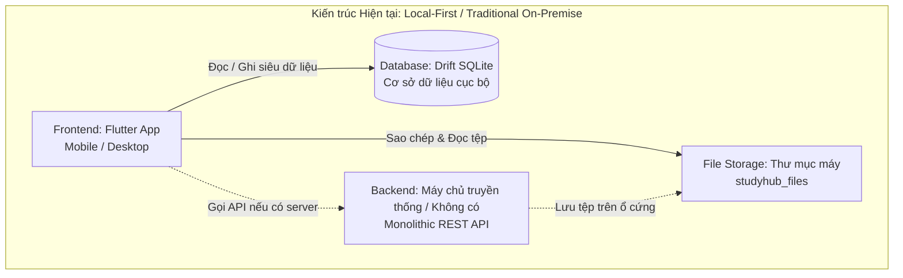
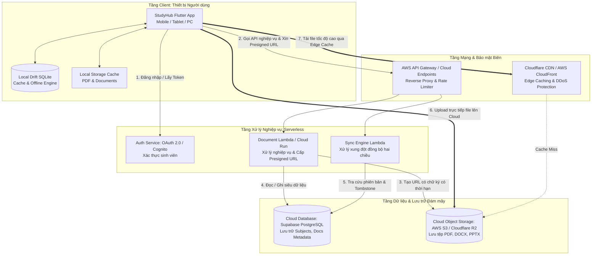
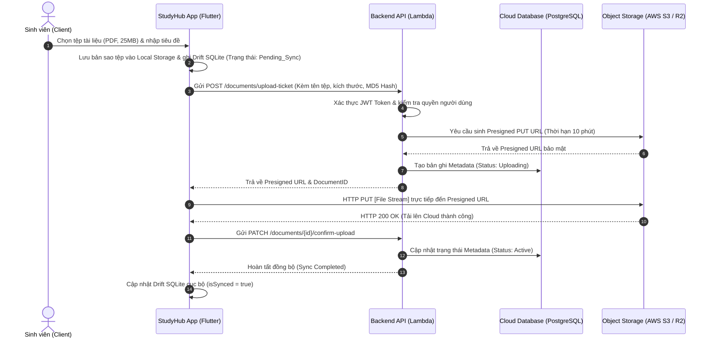
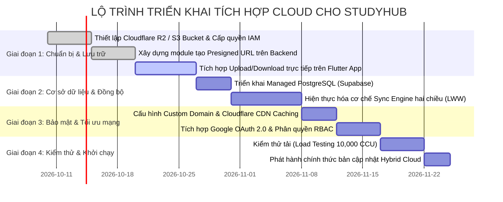

# BÁO CÁO PHÂN TÍCH VÀ LẬP PHƯƠNG ÁN TÍCH HỢP CLOUD CHO HỆ THỐNG QUẢN LÝ TÀI LIỆU HỌC TẬP (STUDYHUB)

**Học phần:** Phát triển Ứng dụng Di động & Điện toán Đám mây  
**Đề tài:** Phân tích và Lập phương án tích hợp Cloud cho Hệ thống Quản lý Tài liệu Học tập  
**Đối tượng khảo sát:** Ứng dụng Quản lý Tài liệu Học tập Thông minh (StudyHub)  

---

## MỤC LỤC
1. [TỔNG QUAN HỆ THỐNG VÀ BỐI CẢNH DỰ ÁN](#1-tổng-quan-hệ-thống-và-bối-cảnh-dự-án)
2. [PHÂN TÍCH CÁC THÀNH PHẦN CỐT LÕI CỦA HỆ THỐNG HIỆN TẠI](#2-phân-tích-các-thành-phần-cốt-lõi-của-hệ-thống-hiện-tại)
3. [XÁC ĐỊNH ĐIỂM NGHẼN VÀ HẠN CHẾ TRÊN HẠ TẦNG TRUYỀN THỐNG](#3-xác-định-điểm-nghẽn-và-hạn-chế-trên-hạ-tầng-truyền-thống)
4. [LỰA CHỌN MÔ HÌNH VÀ DỊCH VỤ ĐIỆN TOÁN ĐÁM MÂY PHÙ HỢP](#4-lựa-chọn-mô-hình-và-dịch-vụ-điện-toán-đám-mây-phù-hợp)
5. [THIẾT KẾ KIẾN TRÚC TÍCH HỢP CLOUD VÀ LUỒNG DỮ LIỆU](#5-thiết-kế-kiến-trúc-tích-hợp-cloud-và-luồng-dữ-liệu)
6. [BẢNG SO SÁNH TOÀN DIỆN GIỮA MÔ HÌNH TRUYỀN THỐNG VÀ CLOUD](#6-bảng-so-sánh-toàn-diện-giữa-mô-hình-truyền-thống-và-cloud)
7. [ĐÁNH GIÁ TÁC ĐỘNG VỀ BẢO MẬT, CHI PHÍ VÀ HIỆU SUẤT](#7-đánh-giá-tác-động-về-bảo-mật-chi-phí-và-hiệu-suất)
8. [LỘ TRÌNH CHUYỂN ĐỔI VÀ KẾT LUẬN](#8-lộ-trình-chuyển-đổi-và-kết-luận)

---

## 1. TỔNG QUAN HỆ THỐNG VÀ BỐI CẢNH DỰ ÁN

### 1.1. Giới thiệu dự án StudyHub
**StudyHub** là hệ thống phần mềm quản lý tài liệu học tập dành cho học sinh, sinh viên và giảng viên. Hệ thống cho phép:
- Quản lý môn học/học phần, phân loại tài liệu (Bài giảng, Đề cương, Slide, Đề thi, Tài liệu tham khảo).
- Hỗ trợ đa dạng định dạng tệp: PDF, DOCX, PPTX và đường dẫn học liệu trực tuyến.
- Xem trước tài liệu PDF trực tiếp trên ứng dụng, hỗ trợ tìm kiếm toàn văn và đánh dấu tài liệu quan trọng.
- Triết lý thiết kế hiện tại: Ứng dụng đa nền tảng (Flutter) hoạt động theo cơ chế **Local-First**, lưu trữ dữ liệu và tệp tin trên bộ nhớ cục bộ của thiết bị.

### 1.2. Lý do chuyển đổi và mục tiêu tích hợp Cloud
Khi nhu cầu người dùng tăng cao (chia sẻ tài liệu giữa các sinh viên, đồng bộ đa thiết bị giữa điện thoại - máy tính - máy tính bảng, truy cập học liệu mọi lúc mọi nơi), mô hình lưu trữ cục bộ thuần túy hoặc máy chủ vật lý truyền thống (On-Premises) bộc lộ nhiều rào cản nghiêm trọng.

**Mục tiêu của phương án tích hợp Cloud:**
- **Mở rộng kho lưu trữ không giới hạn:** Lưu trữ an toàn hàng chục ngàn tài liệu dung lượng lớn (PDF, Slide, Video bài giảng).
- **Truy cập đồng bộ đa thiết bị:** Dữ liệu môn học và tài liệu được đồng bộ tức thì qua tài khoản người dùng.
- **Tối ưu tốc độ tải:** Tận dụng mạng phân phối nội dung (CDN) để sinh viên tải tài liệu với độ trễ thấp nhất.
- **Bảo mật và toàn vẹn dữ liệu:** Mã hóa đa lớp, phân quyền truy cập, sao lưu tự động chống mất mát dữ liệu.
- **Tối ưu hóa chi phí vận hành:** Ứng dụng mô hình điện toán đám mây trả phí theo mức sử dụng thực tế (Pay-as-you-go).

---

## 2. PHÂN TÍCH CÁC THÀNH PHẦN CỐT LÕI CỦA HỆ THỐNG HIỆN TẠI

Trước khi di chuyển lên Cloud, cần bóc tách chi tiết 4 thành phần cơ bản của ứng dụng:

### 2.1. Frontend (Giao diện người dùng)
- **Công nghệ hiện tại:** Xây dựng bằng framework **Flutter**, ngôn ngữ Dart, hỗ trợ đa nền tảng (Android, iOS, Windows, macOS, Web).
- **Nhiệm vụ:**
  - Hiển thị danh mục môn học, danh sách tài liệu dưới dạng lưới (Grid) hoặc danh sách (List).
  - Trình xem tài liệu PDF tích hợp (`SfPdfViewer`).
  - Quản lý trạng thái ứng dụng (State Management với Provider/Riverpod).
- **Khả năng chuyển đổi:** Rất cao. Do tách biệt tốt tầng giao diện và tầng dữ liệu (Clean Architecture), Frontend chỉ cần cập nhật tầng Repository/Data Source để giao tiếp với Cloud API thay vì chỉ đọc SQLite cục bộ.

### 2.2. Backend (Tầng xử lý nghiệp vụ)
- **Trạng thái hiện tại:**
  - *Mô hình 1 (Hiện hữu):* Client-driven hoàn toàn (Local Business Logic). Mọi quy tắc thêm, sửa, xóa, lọc môn học đều chạy trực tiếp trên thiết bị client.
  - *Mô hình 2 (Mô hình truyền thống tương đương):* Máy chủ Monolithic truyền thống (viết bằng Node.js Express, Java Spring Boot hoặc Python Django) cài trên máy chủ vật lý/VPS cố định, tiếp nhận toàn bộ request và xử lý cả tệp tin lẫn nghiệp vụ.
- **Nhiệm vụ:** Xác thực người dùng, kiểm tra quyền truy cập tài liệu, ghi log lịch sử, điều phối luồng dữ liệu.
- **Khả năng chuyển đổi:** Thích hợp chuyển đổi sang **Serverless Functions** (AWS Lambda / Google Cloud Functions) hoặc **Microservices trên Container** (Google Cloud Run / AWS ECS) để tự động co giãn theo lượng truy cập.

### 2.3. Database (Cơ sở dữ liệu)
- **Công nghệ hiện tại:** Cơ sở dữ liệu quan hệ nhúng **Drift (SQLite)** chạy trực tiếp trên từng thiết bị client, hoặc hệ quản trị RDBMS (MySQL / PostgreSQL) chạy trên máy chủ đơn lẻ.
- **Cấu trúc dữ liệu:**
  - Bảng `Subjects`: Thông tin môn học (ID, tên, mã môn, màu sắc, icon, thời gian tạo/sửa).
  - Bảng `Documents`: Thông tin tài liệu (ID, tiêu đề, đường dẫn tệp `filePath`, kích thước `fileSize`, loại tệp `fileType`, cờ ghim `isPinned`, ID môn học).
  - Bảng `DeleteLogs`: Ghi nhận các bản ghi bị xóa (Tombstone pattern) phục vụ giải quyết xung đột đồng bộ.
- **Khả năng chuyển đổi:** Dễ dàng chuyển dịch thành **Managed Database** trên Cloud (như PostgreSQL trên Supabase/AWS RDS Aurora hoặc Cloud Firestore NoSQL) kết hợp cơ chế đồng bộ nền (Sync Engine) với SQLite trên máy client.

### 2.4. File Storage (Lưu trữ tệp tin)
- **Công nghệ hiện tại:** Lưu trữ trực tiếp trên hệ thống tệp cục bộ (`studyhub_files` trong bộ nhớ trong của thiết bị hoặc ổ đĩa cứng máy chủ vật lý).
- **Bản chất:** Quản lý tệp nhị phân (Binary Object) phân cấp theo thư mục.
- **Khả năng chuyển đổi:** Cực kỳ cấp thiết. Cần tách hoàn toàn tệp nhị phân ra khỏi máy chủ ứng dụng và chuyển sang **Object Storage trên Đám mây** (AWS S3, Google Cloud Storage, Cloudflare R2).

---

## 3. XÁC ĐỊNH ĐIỂM NGHẼN VÀ HẠN CHẾ TRÊN HẠ TẦNG TRUYỀN THỐNG

| Thành phần | Điểm nghẽn / Hạn chế trên hạ tầng truyền thống | Hậu quả thực tế đối với ứng dụng |
|---|---|---|
| **Lưu trữ (Storage Scalability)** | - Giới hạn dung lượng ổ cứng cố định trên thiết bị/máy chủ. - Khi sinh viên tải lên hàng loạt slide, video bài giảng chất lượng cao, ổ đĩa nhanh chóng bị đầy. - Việc nâng cấp phần cứng (Scale-up) đòi hỏi thời gian dừng hệ thống (Downtime). | Ứng dụng báo lỗi "Hết dung lượng bộ nhớ", sinh viên không thể thêm tài liệu mới vào mùa ôn thi. |
| **Tính sẵn sàng & Độ bền (Availability & Durability)** | - Điểm lỗi đơn lẻ (**Single Point of Failure - SPOF**): Nếu ổ cứng vật lý bị hỏng hoặc điện thoại bị mất, dữ liệu tài liệu mất vĩnh viễn. - Thiếu cơ chế sao lưu dự phòng phân tán đa vùng (Multi-AZ / Geo-redundancy). | Mất mát tài liệu quan trọng, đề cương, bài tập mà người dùng đã tích lũy qua nhiều học kỳ. |
| **Băng thông & Tải từ xa (Remote Access & Bandwidth)** | - Khi đặt máy chủ truyền thống tại trường hoặc thuê VPS giá rẻ, băng thông đường truyền (Upload/Download) bị giới hạn. - Máy chủ phải gánh cả 2 việc: vừa xử lý logic API, vừa truyền tải luồng dữ liệu file nhị phân (File I/O bottleneck). | Hiện tượng "Nghẽn cổ chai" (Bottleneck) khi hàng trăm sinh viên cùng tải đề cương trước giờ thi; tải file chậm hoặc đứt kết nối giữa chừng. |
| **Chi phí vận hành (CapEx vs OpEx)** | - Chi phí đầu tư ban đầu cao (CapEx): Mua sắm máy chủ, UPS, hệ thống làm mát, đường truyền mạng chuyên dụng. - Máy chủ phải luôn hoạt động 24/7 ngay cả trong kỳ nghỉ hè (lãng phí tài nguyên). | Chi phí bảo trì, tiền điện, nhân sự quản trị hệ thống quá lớn đối với một dự án học tập/sinh viên. |
| **Bảo mật & Phân quyền (Security & Compliance)** | - Dễ bị tấn công Local File Inclusion hoặc rò rỉ đường dẫn file nhạy cảm. - Không có cơ chế phân quyền chi tiết (RBAC) cho từng tệp. - Dữ liệu không được mã hóa ở trạng thái nghỉ (At-Rest) và khi truyền tải (In-Transit). | Sinh viên có thể vô tình xem hoặc sửa/xóa tài liệu kiểm tra của giảng viên nếu để chung thư mục lưu trữ. |

---

## 4. LỰA CHỌN MÔ HÌNH VÀ DỊCH VỤ ĐIỆN TOÁN ĐÁM MÂY PHÙ HỢP

### 4.1. Lựa chọn mô hình triển khai (Deployment Model)
Có 3 mô hình triển khai chính:
1. **Public Cloud (Đám mây công cộng):** Toàn bộ hạ tầng do các nhà cung cấp lớn (AWS, Google Cloud, Microsoft Azure) quản lý.
2. **Private Cloud (Đám mây riêng):** Xây dựng hạ tầng ảo hóa riêng trong trung tâm dữ liệu nội bộ của nhà trường/tổ chức.
3. **Hybrid Cloud (Đám mây lai):** Kết hợp giữa Private Cloud / On-Premise / Edge Client và Public Cloud.

**Đề xuất lựa chọn: Mô hình HYBRID CLOUD (Đám mây lai kết hợp triết lý Local-First)**
- **Lý do lựa chọn:**
  - StudyHub là ứng dụng học tập, sinh viên thường xuyên học ở những nơi sóng yếu hoặc không có Wi-Fi (thư viện, giảng đường tầng hầm, xe bus). Do đó, giữ lại **Database SQLite cục bộ trên máy** là giải pháp tối ưu trải nghiệm (truy cập tức thì, đọc sách offline).
  - Tích hợp **Public Cloud (AWS/GCP)** để làm trung tâm lưu trữ Object Storage cho file tài liệu, máy chủ xác thực tài khoản và sao lưu đồng bộ dữ liệu tập trung.
  - Khi có mạng, hệ thống tự động đồng bộ lên Public Cloud; khi mất mạng, ứng dụng vẫn hoạt động mượt mà 100%.

### 4.2. Lựa chọn mô hình dịch vụ (Service Model)
- **Sử dụng kết hợp PaaS (Platform as a Service) và Serverless (FaaS - Function as a Service):**
  - Không quản lý máy chủ vật lý hay hệ điều hành (loại bỏ IaaS phức tạp).
  - Tự động mở rộng tài nguyên từ 0 request đến hàng ngàn request mà không cần can thiệp thủ công.
  - Giảm thiểu tối đa chi phí quản trị hệ thống (NoOps).

### 4.3. Lựa chọn các dịch vụ Cloud cụ thể

| Thành phần | Dịch vụ được lựa chọn | Dịch vụ thay thế khả thi | Lý do chọn lựa cho StudyHub |
|---|---|---|---|
| **File Storage (Lưu trữ tệp tin)** | **AWS S3** *(Amazon Simple Storage Service)* hoặc **Cloudflare R2** | Google Cloud Storage (GCS), Azure Blob Storage | - Độ bền dữ liệu đạt **99.999999999% (11 số 9)**. - Hỗ trợ **Presigned URLs**: Ứng dụng tải file trực tiếp lên S3 mà không cần qua máy chủ backend. - Cloudflare R2 tương thích S3 API và **miễn phí 100% băng thông tải xuống (Zero Egress Fee)**, cực kỳ tiết kiệm chi phí cho môi trường sinh viên. |
| **Mạng phân phối nội dung (CDN)** | **Amazon CloudFront** / **Cloudflare CDN** | Fastly, Akamai | - Lưu trữ bộ nhớ đệm (Cache) tài liệu tại các Edge Server gần người dùng nhất (Hà Nội, TP.HCM). - Tăng tốc độ mở file PDF từ vài giây xuống dưới 200ms. |
| **Backend / API** | **Serverless (AWS Lambda + API Gateway)** hoặc **Google Cloud Run** | Node.js trên AWS EC2, Heroku | - Chỉ trả tiền khi có lệnh gọi API (Pay per invocation). - Tự động co giãn theo mùa thi cử, giảm tải về 0 vào ban đêm và kỳ nghỉ. |
| **Cơ sở dữ liệu đám mây (Cloud Database)** | **Supabase (PostgreSQL Managed)** hoặc **AWS RDS Aurora Serverless** | Google Cloud Firestore, MongoDB Atlas | - Hỗ trợ chuẩn SQL quan hệ, tính toàn vẹn dữ liệu ACID. - Có sẵn cơ chế Realtime Webhook hỗ trợ phát hiện dữ liệu thay đổi để đồng bộ xuống máy client. |
| **Xác thực & Bảo mật (Auth & Security)** | **Google OAuth 2.0 / AWS Cognito** | Firebase Authentication, Auth0 | - Sinh viên đăng nhập nhanh bằng tài khoản Google / Email trường đại học. - Tích hợp chặt chẽ với cơ chế bảo mật cấp quyền IAM. |

---

## 5. THIẾT KẾ KIẾN TRÚC TÍCH HỢP CLOUD VÀ LUỒNG DỮ LIỆU

### 5.1. Sơ đồ kiến trúc tổng thể sau khi tích hợp Cloud

### 5.2. Mô tả các luồng dữ liệu chính (Data Flows)

#### Luồng 1: Tải lên tài liệu mới (Direct-to-Cloud Upload Flow)
Để giải phóng hoàn toàn gánh nặng xử lý tệp cho máy chủ backend, hệ thống sử dụng kỹ thuật **Presigned URL (URL ký trước)**:

*Lợi ích đột phá:* Máy chủ Backend hoàn toàn không phải chạm vào 25MB dữ liệu nhị phân, tiết kiệm 100% băng thông và bộ nhớ RAM của máy chủ, cho phép hàng chục nghìn người cùng tải lên một lúc mà không bị quá tải.

#### Luồng 2: Xem và tải tài liệu về máy (Download & CDN Acceleration Flow)
1. Khi sinh viên bấm "Xem trước" tài liệu PDF trên một thiết bị mới (chưa có file ở bộ nhớ cục bộ):
2. Ứng dụng kiểm tra bộ nhớ đệm máy: Nếu chưa có, gửi yêu cầu đọc qua CDN Edge URL: `https://cdn.studyhub.edu.vn/docs/{uuid}.pdf`.
3. Nếu CDN Edge đã có bản sao trong bộ nhớ đệm (Cache Hit): Tệp PDF được trả về tức thì với băng thông tối đa của mạng nội địa (độ trễ < 30ms).
4. Nếu chưa có trên Edge (Cache Miss): CDN tự động lấy tệp từ AWS S3 / R2, lưu một bản sao tại Edge và trả về cho ứng dụng.
5. Ứng dụng vừa hiển thị trực tiếp trên trình đọc `SfPdfViewer`, vừa lưu vào bộ nhớ đệm máy (`Local Cache`) để lần mở sau không cần dùng Internet.

#### Luồng 3: Đồng bộ hai chiều (Bidirectional Sync & Conflict Resolution)
- Dựa trên cơ chế **Tombstone (nhật ký xóa `DeleteLogs`)** và trường nhãn thời gian `dateTimeModified` đã có sẵn trong kiến trúc StudyHub:
- Khi có mạng, ứng dụng gửi danh sách các thay đổi kể từ lần đồng bộ cuối cùng (`lastSyncTimestamp`).
- Hệ thống áp dụng quy tắc **Last-Write-Wins (LWW)** hoặc kiểm tra phiên bản (Revision Tracking) để tự động hợp nhất dữ liệu môn học, đảm bảo dữ liệu không bị ghi đè nhầm lẫn.

---

## 6. BẢNG SO SÁNH TOÀN DIỆN GIỮA MÔ HÌNH TRUYỀN THỐNG VÀ CLOUD

| Tiêu chí so sánh | Mô hình Truyền thống (On-Premises / Local-Only) | Mô hình Tích hợp Cloud (Hybrid Cloud + Serverless) |
|---|---|---|
| **1. Khả năng mở rộng (Scalability)** | **Thụ động & Giới hạn:** - Bị kịch trần bởi dung lượng ổ cứng và cấu hình RAM/CPU của một máy chủ cố định. - Nâng cấp phức tạp, phải mua thêm phần cứng và gián đoạn dịch vụ. | **Tự động & Không giới hạn:** - Object Storage lưu trữ hàng Petabyte mà không cần cấu hình trước. - Backend tự động scale số instance từ 1 lên 1000 theo tải thực tế. |
| **2. Độ bền & Sẵn sàng (Durability & Availability)** | **Rủi ro cao:** - Điểm lỗi đơn lẻ (SPOF). Nếu hư ổ cứng, cháy nổ, ngập nước hoặc mất thiết bị là mất toàn bộ dữ liệu. - SLA thường dưới 99%. | **Tiêu chuẩn công nghiệp:** - Độ bền dữ liệu 99.999999999% (11 số 9) nhờ tự động nhân bản ra tối thiểu 3 vùng khả dụng (Availability Zones). - Tự phục hồi thảm họa (Disaster Recovery). |
| **3. Hiệu năng & Tốc độ truy cập** | **Kém khi truy cập từ xa:** - Bị ảnh hưởng bởi đường truyền mạng của nơi đặt máy chủ. - Dễ nghẽn cổ chai I/O khi nhiều sinh viên tải file dung lượng lớn cùng lúc. | **Cực nhanh toàn cầu:** - Tích hợp CDN đưa tài liệu tới các trạm Edge gần sinh viên nhất. - Presigned URL tách biệt luồng file khỏi luồng API logic. |
| **4. Mô hình chi phí (Cost Structure)** | **Chi phí cố định cao (CapEx):** - Mua máy chủ ban đầu, chi phí điện, điều hòa, phòng server. - Lãng phí tài nguyên vào kỳ nghỉ hè hoặc ban đêm khi ít người dùng. | **Chi phí linh hoạt (OpEx):** - Trả đúng những gì sử dụng (Pay-as-you-go). - Lưu 10GB trả 10GB; ban đêm không có sinh viên truy cập thì chi phí Compute = 0$. |
| **5. Quản trị & Bảo trì (Maintenance)** | **Phức tạp & Tốn nhân lực:** - Phải tự vá lỗi hệ điều hành, cấu hình tường lửa, theo dõi nhiệt độ, thay thế ổ đĩa hỏng định kỳ. | **Tự động hóa hoàn toàn (NoOps):** - Nhà cung cấp Cloud chịu trách nhiệm bảo trì hạ tầng vật lý. - Kỹ sư tập trung 100% vào tính năng sản phẩm và trải nghiệm người dùng. |
| **6. Khả năng làm việc ngoại tuyến (Offline)** | Chỉ chạy được cục bộ trên một máy đơn lẻ, không thể đồng bộ sang thiết bị khác nếu không có server. | **Hài hòa tuyệt đối:** - Vẫn duy trì tốc độ tức thì của SQLite khi offline, tự động đồng bộ khi có Internet. |

---

## 7. ĐÁNH GIÁ TÁC ĐỘNG VỀ BẢO MẬT, CHI PHÍ VÀ HIỆU SUẤT

### 7.1. Đánh giá tác động về Bảo mật (Security Impact)
Việc chuyển đổi lên Cloud mang lại kiến trúc bảo mật nhiều lớp chuẩn Zero-Trust:
1. **Mã hóa dữ liệu toàn trình:**
   - **Data in-transit (Đang truyền tải):** Bắt buộc sử dụng giao thức HTTPS/TLS 1.3 với chứng chỉ SSL được quản lý tự động. Không một bên trung gian nào có thể xem lén tài liệu khi đang truyền tải trên Wi-Fi công cộng.
   - **Data at-rest (Tại nơi lưu trữ):** Toàn bộ tệp tin trên S3/R2 và cơ sở dữ liệu PostgreSQL đều được mã hóa tự động bằng thuật toán chuẩn quân đội **AES-256** thông qua dịch vụ quản lý khóa **KMS (Key Management Service)**.
2. **Kiểm soát truy cập phân quyền chi tiết (Least Privilege & RBAC):**
   - Không công khai bucket chứa tài liệu ra Internet (Block Public Access 100%).
   - Tệp chỉ có thể tải thông qua **Presigned URL có chữ ký mật mã** và thời gian sống ngắn (ví dụ: chỉ có hiệu lực trong 5 - 15 phút). Hết hạn link sẽ tự vô hiệu hóa, ngăn chặn việc phát tán liên kết trái phép ra bên ngoài.
3. **Phòng chống tấn công mạng:**
   - Cloudflare WAF và AWS Shield giúp ngăn chặn các cuộc tấn công từ chối dịch vụ phân tán (DDoS), bảo vệ ứng dụng luôn hoạt động ổn định trong các kỳ thi học kỳ.

### 7.2. Đánh giá tác động về Chi phí (Cost Impact & TCO)
Phân tích Tổng chi phí sở hữu (Total Cost of Ownership - TCO) cho kịch bản quy mô **10.000 sinh viên hoạt động hàng tháng (MAU)**:

*Ước tính dữ liệu trung bình:*
- Dung lượng lưu trữ: 500 GB tài liệu học tập (khoảng 50.000 tệp PDF/Slide).
- Lưu lượng tải xuống hàng tháng: 1.500 GB (1.5 TB).
- Số lượng yêu cầu API: 2.000.000 lượt/tháng.

**Bảng dự toán chi phí hàng tháng trên nền tảng Cloud tối ưu (Cloudflare R2 + Supabase + AWS Lambda):**

| Thành phần dịch vụ | Cách tính chi phí | Chi phí ước tính / Tháng |
|---|---|:---:|
| **Storage (Cloudflare R2)** | - 10 GB đầu miễn phí; 490 GB x $0.015 / GB | **$7.35** |
| **Data Egress (Băng thông tải ra)** | - Cloudflare R2 miễn phí 100% Egress Fee | **$0.00** *(Tiết kiệm ~130$ so với S3)* |
| **Database (Supabase Pro Tier)** | - Gói tiêu chuẩn: Hỗ trợ 8GB DB, 100k active users, backups tự động | **$25.00** |
| **Compute / API (AWS Lambda)** | - 2M requests (Free Tier 1M requests; 1M còn lại x $0.20/1M) | **$0.20** |
| **Domain & DNS / SSL** | - Tích hợp Cloudflare Free Plan | **$0.00** |
| **TỔNG CỘNG HÀNG THÁNG** |  | **~$32.55 / tháng** (~800.000 VNĐ) |

> **Nhận xét kinh tế:** So với việc mua một máy chủ vật lý ban đầu (từ 20 - 40 triệu VNĐ) cộng với tiền điện, đường truyền Internet IP tĩnh và chi phí bảo trì hàng tháng (trên 2.000.000 VNĐ/tháng), giải pháp Cloud tiết kiệm hơn **70% chi phí vận hành** trong năm đầu tiên và hoàn toàn không chịu rủi ro hao mòn phần cứng.

### 7.3. Đánh giá tác động về Hiệu suất (Performance Impact)
- **Tốc độ đọc và phản hồi (Latency):**
  - Nhờ cơ chế **Local-First**, các thao tác duyệt danh mục, tìm kiếm tài liệu diễn ra với độ trễ **0ms (phản hồi ngay lập tức)** từ bộ nhớ SQLite cục bộ.
  - Tải file PDF từ CDN Edge mất **< 200ms** (so với 2000ms - 5000ms khi kéo file trực tiếp từ máy chủ đơn lẻ ở xa).
- **Giải phóng tắc nghẽn I/O (Throughput):**
  - Tách luồng tải tệp qua Presigned URL giúp máy chủ API duy trì thời gian phản hồi API trung bình dưới **50ms**, ngay cả khi có hàng nghìn sinh viên đang nộp bài hoặc tải đề thi đồng thời.
- **Tỷ lệ sẵn sàng (Availability):**
  - Đạt tiêu chuẩn **99.95% uptime**, loại bỏ hoàn toàn các sự cố sập hệ thống cục bộ do mất điện hoặc đứt cáp mạng văn phòng.

---

## 8. LỘ TRÌNH CHUYỂN ĐỔI VÀ KẾT LUẬN

### 8.1. Lộ trình triển khai 4 giai đoạn (Migration Roadmap)

### 8.2. Kết luận
Phương án tích hợp Điện toán đám mây cho hệ thống **StudyHub** là bước tiến mang tính chiến lược, giải quyết triệt để các rào cản cố hữu của mô hình lưu trữ cục bộ và máy chủ truyền thống:
1. Giữ nguyên ưu thế vượt trội của kiến trúc **Local-First** (tốc độ cao, xem tài liệu offline mọi lúc mọi nơi).
2. Tận dụng sức mạnh của **Public Cloud Storage (S3/R2)** và **CDN** để mở rộng kho tài liệu không giới hạn với chi phí chỉ vài chục nghìn đồng mỗi tháng.
3. Nâng cấp chuẩn mực an toàn dữ liệu học tập với mã hóa đa tầng và đường dẫn bảo vệ có thời hạn.

Bản đề xuất này cung cấp một kế hoạch kỹ thuật hoàn chỉnh, khả thi cao và sẵn sàng đưa vào áp dụng thực tế cho đồ án môn học cũng như sản phẩm thực tế.
