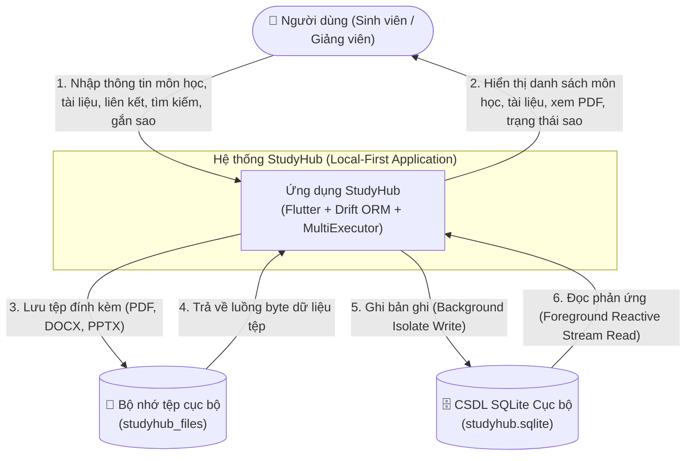
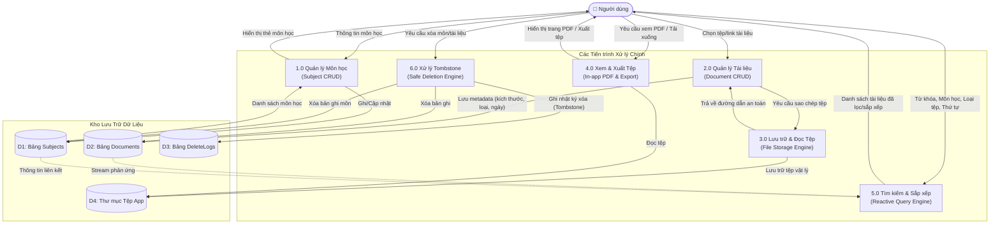
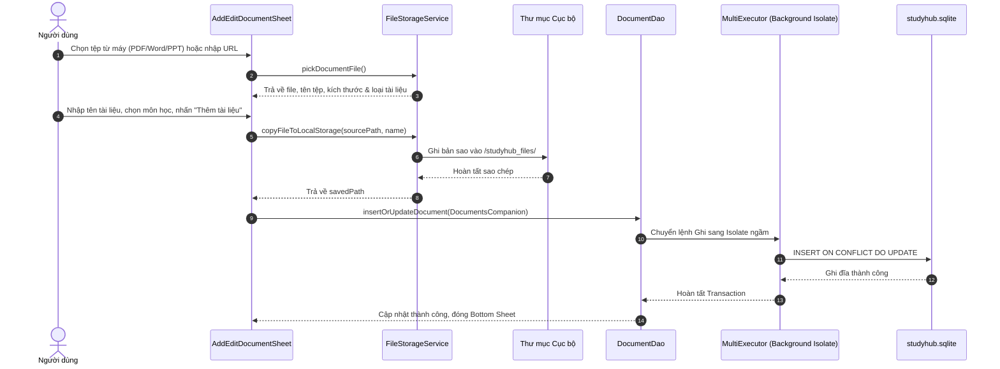
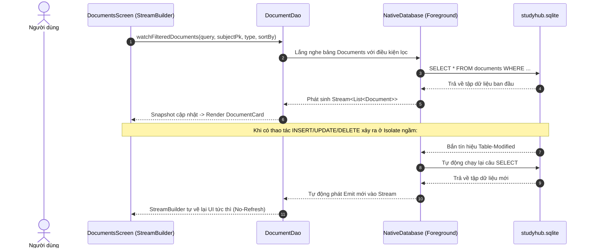
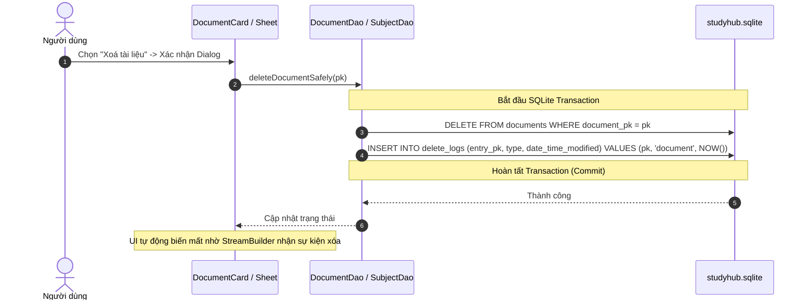

# 📊 SƠ ĐỒ LUỒNG DỮ LIỆU (DATA FLOW DIAGRAM - DFD)
## DỰ ÁN: STUDYHUB - HỆ THỐNG QUẢN LÝ TÀI LIỆU HỌC TẬP THÔNG MINH

---

## 1. SƠ ĐỒ NGỮ CẢNH HỆ THỐNG (DFD MỨC 0 - CONTEXT DIAGRAM)

Sơ đồ thể hiện tương tác dữ liệu tổng quan giữa Người dùng, Hệ thống StudyHub và các kho lưu trữ cục bộ.

---

## 2. SƠ ĐỒ PHÂN RÃ CHỨC NĂNG (DFD MỨC 1 - SYSTEM PROCESSES)

Sơ đồ phân rã các tiến trình nghiệp vụ cốt lõi bên trong StudyHub.

---

## 3. SƠ ĐỒ CHI TIẾT CÁC LUỒNG DỮ LIỆU ĐẶC THÙ (DFD MỨC 2)

### 3.1. Luồng Thêm Mới Tài liệu (Add Document Flow)

### 3.2. Luồng Phản ứng Truy vấn Dữ liệu (Reactive Watch Query Flow)

### 3.3. Luồng Xóa An Toàn & Cơ chế Tombstone (Cashew Deletion Architecture)

